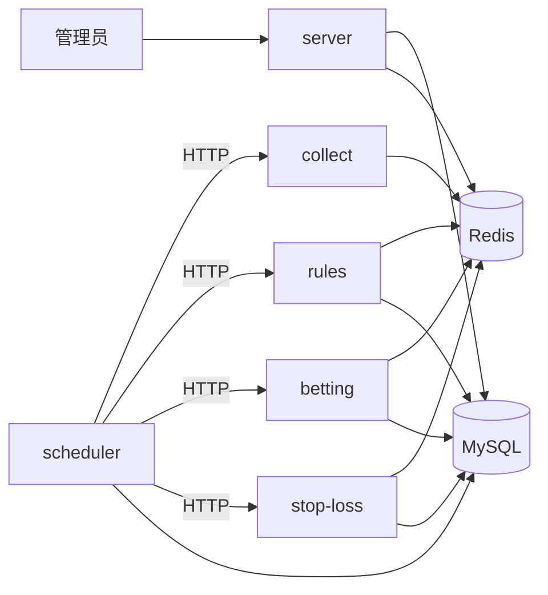

# 模块边界与限制

本文定义 **五服务之间** 以及 **五服务与 server/client** 之间的职责边界、协作方式与硬性限制。改某一服务前请先读本文。

大模块划分与 **实现顺序（scheduler → collect → rules → betting → stop-loss）** 见 [项目模块与实施优先级](./项目模块与实施优先级.md)。

---

## 1. 拆分原则

| 原则 | 说明 |
|------|------|
| 单一职责 | 每个服务一条业务链路；采集按 **sport 插件** 扩展（tennis / nba / dota…） |
| 数据共享 | Redis 存采集快照与三桶；MySQL 存引擎配置、调度、订单 |
| 调度外置 | 仅 **scheduler** 做定时；业务服务只暴露「执行一次」接口 |
| 可独立启停 | 采集 / 规则 / 投注引擎可分别开关 |
| 沿用 IPWO | 外网采集统一走 IPWO 代理 |
| 默认原配置 | 首次迁移 **沿用** 现网 MySQL/Redis，不重置 |
| 配置可改 | 后台改配置 → 各服务热读 |
| Docker 独立 | 每服务自带 Dockerfile，可单独部署 |
| **改动隔离** | **改谁只动谁**，不顺便改其它服务目录 |

---

## 2. 模块职责矩阵

| 模块 | 做什么 | 不做什么 |
|------|--------|----------|
| **collect** | 拉取赛事数据写 Redis；支持多 sport | 规则过滤、下单、调度 |
| **rules** | 读三桶 → 规则筛选 → 写 matched 集 | 采集、下单、止损 |
| **betting** | 读 matched → Polymarket 买入 → 写订单 | 采集、规则计算、止损 |
| **stop-loss** | 读 open 订单 + inplay 数据 → 评估 → 全平 | 采集、规则、买入 |
| **scheduler** | 轮询 job → HTTP 调上述四服务 | 业务逻辑实现 |
| **server** | 用户 API、管理后台、配置 **写入**、对外 Engine API | 内嵌调度/采集/投注引擎（迁移后移除） |

---

## 3. 模块间调用关系



| 调用方 | 被调方 | 方式 | 说明 |
|--------|--------|------|------|
| scheduler | collect | `POST /internal/collect/full\|partial` | body 带 `sport` |
| scheduler | rules | `POST /internal/rules/evaluate` | body 带 `bucket` |
| scheduler | betting | `POST /internal/betting/scan` | body 带 `bucket` |
| scheduler | stop-loss | `POST /internal/stop-loss/scan` | 无 open inplay 订单可 skip |
| betting | — | 只读 Redis matched | **不** HTTP 调 rules |
| stop-loss | — | 只读 Redis + MySQL 订单 | **不** HTTP 调 betting |
| server | scheduler | 可选代理「立即执行」 | 配置写仍走 server |

**禁止**：服务间 `require()` / `import` 其它 `services/*` 代码。

---

## 4. 共享数据契约（Redis / MySQL）

### 4.1 Redis key 约定

| Key 模式 | 写入方 | 读取方 |
|----------|--------|--------|
| `{sport}:bundle:full`、三桶 | collect | rules、server |
| `{sport}:rules:matched:*` | rules | betting |
| `tennis:engines:config*` | server（镜像） | 全部服务只读 |
| 订单缓存（若有） | betting | stop-loss |

- 首期 tennis key **保持现网**（如 `tennis:bundle:full`）。
- 新增 sport 用 `{sport}:` 前缀；**改 key 须兼容旧读** 或走版本迁移。

### 4.2 MySQL

| 表/用途 | 写 | 读 |
|---------|----|----|
| `tennis_engines_config` | server | collect / rules / betting / stop-loss |
| `scheduler_jobs` / `scheduler_runs` | server、scheduler | scheduler |
| 订单 / 成交 | betting、stop-loss | stop-loss、server |

---

## 5. 改动隔离（改谁只动谁）

| 场景 | 允许 | 禁止 |
|------|------|------|
| 修 collect / 加 NBA | 只改 `services/collect/` | 顺带改 rules、server 等 |
| 升级 betting 镜像 | 只 rebuild betting | 为 CI 改 stop-loss Dockerfile |
| 调整 rules | 只改 `services/rules/` | 在 betting 复制规则逻辑 |
| 调度调 collect | 只改 scheduler HTTP/env | import collect 代码 |
| 共用 PM 客户端 | `packages/polymarket/` 各服务依赖 | 跨目录直接改文件 |

### 执行需求

1. **REQ-ISO-01** 禁止跨 `services/*` 代码引用；仅 HTTP、Redis、MySQL。
2. **REQ-ISO-02** PR 默认单服务；跨服务须分列说明。
3. **REQ-ISO-03** CI 按路径分 build：`services/collect/**` 只 build collect。
4. **REQ-ISO-04** 接口 breaking change 先 `/v2` 或兼容字段。
5. **REQ-ISO-05** 改五服务时 **不** 改 `server/`/`client/`（除非明确需求）。
6. **REQ-ISO-06** 共享库放 `packages/*`，禁止跨目录改文件。

### 跨服务协作流程

```
服务 A 改动 → 只提交 services/A/
需 B 配合 → 先定 HTTP/Redis 契约 → 再分别改 A、B（可分两个 PR）
```

---

## 6. 配置管理（共用）

| 项 | 说明 |
|----|------|
| 主存 | MySQL；Redis 镜像 |
| 写入口 | **仅 server** + 管理后台 |
| 五服务 | **只读**；每次任务执行前读最新值 |
| `.env` | 各服务仅运行参数（端口、URL、Token、IPWO） |

详见各服务文档中的「默认配置 / 可修改配置」条款。

**REQ-CFG-01 ~ 04**：不硬覆盖现网；五服务不提供对外写配置 API；变更可审计。

---

## 7. Docker 独立部署（共用）

| 项 | 说明 |
|----|------|
| 一服务一镜像 | 各自 `Dockerfile` + `docker-compose.yml` |
| 单独可启 | env 指向外部 Redis/MySQL/其它服务 URL |
| 不强绑 | compose 不写死五服务 `depends_on` |
| 与 server 并列 | 现有 `docker-compose.core.yml` 不变 |

**scheduler 必填 env**：`COLLECT_URL`、`RULES_URL`、`BETTING_URL`、`STOP_LOSS_URL`。

**REQ-DKR-01 ~ 08**：独立 build/health；单服务升级不修改其它服务 Dockerfile。

---

## 8. 调度顺序（同 tick 内）

scheduler 在同一轮次建议固定顺序：

```
partial 采集 → rules 评估 → betting 扫描 → stop-loss 扫描
```

保证 inplay 比分/PM 先于规则、止损使用。

---

## 9. 非功能需求

1. **REQ-NF-01** 单服务崩溃不影响其它服务；scheduler 记 failed run 并重试。
2. **REQ-NF-02** 日志带 `jobId` / `runId`。
3. **REQ-NF-03** 见 §8 调度顺序。
4. **REQ-NF-04** Secrets 不进 Git；业务配置走 MySQL/Redis。
5. **REQ-NF-05** 零配置重置：改后台一项 → 下次执行行为变化。
6. **REQ-NF-06** 单服务 PR diff 不出现其它 `services/*` 路径（`packages/*` 除外须说明）。

---

## 10. 服务间 HTTP 约定

```
Authorization: Bearer ${INTERNAL_SERVICE_TOKEN}
Content-Type: application/json
```

各服务默认内网 `expose`；对外由 server + Nginx 暴露。

---

*详见各服务独立文档 → [README](./README.md)*
