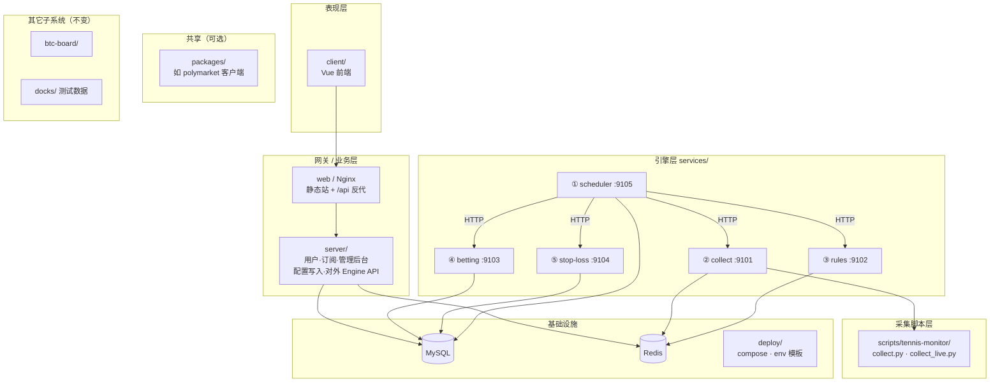

# 项目模块与实施优先级

本文先划定 **仓库大模块** 边界，再规定 **五服务实现顺序**：**① 调度 → ② 采集 → ③ 规则 → ④ 投注 → ⑤ 止损**。

协作契约见 [模块边界与限制](./模块边界与限制.md)；各服务细节见对应服务文档。

---

## 一、大项目模块划分

整个 **bbbbb / teniesyuce** 按层划分为以下 **大模块**。五服务只是其中 **引擎层** 的五个子模块；实施时 **先定边界、再按优先级落地引擎**。



### 1.1 模块清单

| 大模块 | 路径 | 职责 | 与五服务关系 |
|--------|------|------|--------------|
| **前端** | `client/` | 用户页、管理后台 UI | 不改引擎逻辑；调度/引擎配置仍调 `server` API |
| **业务网关** | `server/` | 登录、订阅、产品、**配置写入**、对外 Engine API | 迁移后 **去掉** 内嵌 scheduler/collect/bet loop；可 **代理** scheduler |
| **Web 反代** | `web/`、`docker-compose.core.yml` | Nginx、静态资源 | 可选暴露五服务 **仅内网**，不直接公网 |
| **调度引擎** | `services/scheduler/` | **唯一定时触发** | 实施 **优先级 1** |
| **采集引擎** | `services/collect/` | 赛事数据 → Redis | 优先级 **2** |
| **规则引擎** | `services/rules/` | 三桶 → matched | 优先级 **3** |
| **投注引擎** | `services/betting/` | matched → 买入 | 优先级 **4** |
| **止损引擎** | `services/stop-loss/` | open 订单 → 全平 | 优先级 **5** |
| **采集脚本** | `scripts/tennis-monitor/` | Python 采集实现 | 由 **collect** 挂载或子进程调用；**不**迁入其它四服务 |
| **共享包** | `packages/*` | PM 客户端等 | 可选；betting/stop-loss **依赖**，不跨目录改文件 |
| **部署** | `deploy/` | compose、env 模板 | 每服务独立 compose + 可选总 compose |
| **基础设施** | MySQL、Redis | 配置、三桶、订单、调度表 | 五服务 **共用**；配置写入口在 server |
| **BTC 子系统** | `btc-board/` | 链上看板 | **独立**，不在五服务实施范围内 |
| **测试数据** | `docks/` | 虚拟回放 | collect 的 `docks500` 模式 |

### 1.2 大模块依赖规则

| 规则 | 说明 |
|------|------|
| **引擎层不依赖 client** | 五服务可无 UI 独立运行 |
| **配置写只在 server** | 五服务只读 MySQL/Redis 镜像 |
| **定时只在 scheduler** | collect/rules/betting/stop-loss **禁止** 自建 cron |
| **采集脚本归属 collect** | monitor 脚本不放进 rules/betting |
| **改动隔离** | 改一个大模块内的某一服务，不顺便改其它大模块（见 [模块边界与限制](./模块边界与限制.md)） |

### 1.3 首期目录骨架（P0）

实施任何服务前，先落盘 **空骨架**（health + Dockerfile 占位即可）：

```
services/
├── scheduler/     # 优先级 1
├── collect/       # 优先级 2
├── rules/         # 优先级 3
├── betting/       # 优先级 4
└── stop-loss/     # 优先级 5
deploy/
└── docker-compose.services.yml
packages/          # 可选，P4/P5 再建
```

**P0 验收**：五目录存在；各服务 `GET /health` 返回 200；**不写业务逻辑**。

---

## 二、服务实现优先级（总览）

| 顺序 | 服务 | 理由 |
|------|------|------|
| **1** | **scheduler** | 全链路 **总开关**；先定 job 模型、轮询、HTTP 执行器、run 日志；后续服务只需实现 internal API 并被调度 |
| **2** | **collect** | **数据源头**；无采集则 rules/betting/stop-loss 无 Redis 可读 |
| **3** | **rules** | 依赖 collect 写入的三桶；产出 matched 供 betting |
| **4** | **betting** | 依赖 rules 的 matched；产出 open 订单 |
| **5** | **stop-loss** | 依赖 betting 订单 + collect 的 inplay 刷价；链路最后一环 |


---

## 三、分阶段实施说明

### P0 · 大模块骨架（先于一切）

| 项 | 内容 |
|----|------|
| 范围 | `services/*` 五目录、`.env.example`、`Dockerfile`、`/health` |
| 不动 | `server/` 内嵌逻辑 **暂保留**，保证现网可用 |
| 验收 | 五端口 health 200；[项目模块](#11-模块清单) 目录与本文档一致 |

---

### P1 · 优先级 1：调度服务（scheduler）

| 项 | 内容 |
|----|------|
| 目标 | 调度循环、读 `scheduler_jobs`、写 `scheduler_runs`、HTTP 执行器、manual 触发 |
| 迁移 | `schedulerLoop.js`、`schedulerRunner.js`、`schedulerStore.js` |
| 过渡 | 业务 job **可先 HTTP 调现 `server` 遗留接口**（若 collect 等未就绪），或调已部署服务的 stub `/health`；**job 类型与 params 先定稿** |
| 配置 | 沿用现网 `scheduler_jobs`；seed 见 [调度服务](./调度服务.md) |
| 验收 | 调度中心「立即执行」→ scheduler 记 run；interval job 到期触发；**无双进程**（与 server 内嵌 loop 二选一，本阶段可并存调试，P6 关 server 侧） |
| 文档 | [调度服务.md](./调度服务.md) |

**本阶段 collect/rules/betting/stop-loss**：仅需 **health 或空 internal 接口**（返回 `skipped: not implemented`），scheduler 能记录 skip。

---

### P2 · 优先级 2：采集服务（collect）

| 项 | 内容 |
|----|------|
| 目标 | `full` / `partial`；tennis 写 Redis 三桶；IPWO；`docks500` |
| 迁移 | `tennisCollectRunner.js`、`tennisInplayTick.js`、`tennisThreeBuckets.js` + monitor 脚本 |
| 依赖 | scheduler 已有 `collect.full` / `collect.partial` job，**改指** `COLLECT_URL` |
| 验收 | manual + 6h/30s job 触发后 Redis 三桶与现网一致 |
| 文档 | [采集服务.md](./采集服务.md) |

---

### P3 · 优先级 3：规则服务（rules）

| 项 | 内容 |
|----|------|
| 目标 | `evaluate(prematch|inplay)`；写 `tennis:rules:matched:*` |
| 迁移 | `tennisConditionApply.js` + condition 配置读 |
| 依赖 | collect 已写三桶；scheduler job `rules.evaluate` 指向 `RULES_URL` |
| 验收 | prematch/inplay 筛选结果与现 `condition.query` 一致 |
| 文档 | [规则服务.md](./规则服务.md) |

---

### P4 · 优先级 4：投注服务（betting）

| 项 | 内容 |
|----|------|
| 目标 | `scan` 买入；订单落库；`simulate` |
| 迁移 | `tennisBettingEngine.js` buy、`polymarketTrade.js`、`tennisTrade.js` |
| 依赖 | rules 已写 matched；scheduler job `betting.scan` |
| 验收 | simulate 与现 `bet.scan` 一致；open 订单可查 |
| 文档 | [投注服务.md](./投注服务.md) |

---

### P5 · 优先级 5：止损服务（stop-loss）

| 项 | 内容 |
|----|------|
| 目标 | `scan`；仅 inplay open 订单；触发全平 |
| 迁移 | `tennisBettingEngine.js` stop 路径 |
| 依赖 | betting 有 open 订单；collect 30s partial；scheduler job `stop-loss.scan` |
| 验收 | 模拟持仓触发 stopRules → `status=closed` |
| 文档 | [止损服务.md](./止损服务.md) |

---

### P6 · 切流与收尾

| 项 | 内容 |
|----|------|
| server | **移除** `schedulerLoop.start()`、`tennisInplayTickLoop` fallback |
| server | 管理后台调度「立即执行」→ 代理 **scheduler** |
| deploy | 各服务独立升级验证；监控、告警 |
| 验收 | **仅 scheduler** 触发五引擎；改后台配置 → 下次执行生效；单服务 rebuild 不影响其它服务 |

---

## 四、优先级与模块对照表

| 实施顺序 | 服务 | 所属大模块 | 端口 | 阻塞关系 |
|----------|------|------------|------|----------|
| P0 | （骨架） | `services/*` | — | 无 |
| **1** | scheduler | 引擎层 | 9105 | 可先不依赖其它四服务完整实现 |
| **2** | collect | 引擎层 + 脚本层 | 9101 | 阻塞 rules / stop-loss 数据 freshness |
| **3** | rules | 引擎层 | 9102 | 阻塞 betting |
| **4** | betting | 引擎层 | 9103 | 阻塞 stop-loss 订单源 |
| **5** | stop-loss | 引擎层 | 9104 | 链路末端 |
| P6 | server 切流 | 网关层 | 3001 | 五服务均就绪 |

---

## 五、实施纪律（与优先级配套）

1. **严格按 P0 → P1 → … → P6 推进**；未完成 P1 不开始 P2 业务迁移（P0 骨架除外）。
2. **每个优先级只主攻一个服务**；该服务 REQ 完成并验收后再进下一优先级。
3. **改动隔离**：做 P2 collect 时 **不改** rules/betting/stop-loss/scheduler 代码（scheduler 仅改 URL 配置除外）。
4. **server 内嵌引擎**：P1～P5 期间可保留作对照；**P6 必须关闭**，避免双调度。
5. **NBA/Dota 等多 sport**：collect 插件化 **排在 P2 网球稳定之后**，不提前占用 P3～P5。

---

*文档版本：2026-09-17 · 实施顺序：scheduler → collect → rules → betting → stop-loss*
