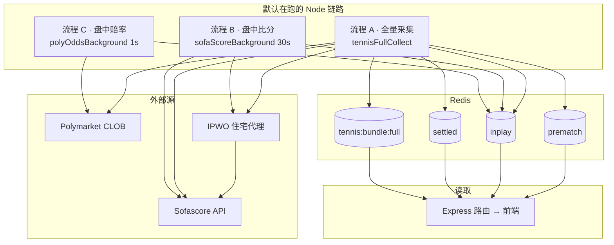

# 网球数据采集流程

当前架构：**Node 为主**，Sofascore 走 IPWO 代理，Polymarket 赔率直连 CLOB。数据写入 Redis 三桶，前端只读缓存。

---

## 1. 一张图看懂



---

## 2. 三条活跃链路

| 流程 | 触发 | 频率 | 数据源 | 写入 | 核心文件 |
|------|------|------|--------|------|----------|
| **A 全量** | 管理页 / 调度 `collect.top100` | 手动或 6h | Sofascore(IPWO) + PM | `full` + 拆三桶 | `tennisFullCollect.js` |
| **B 比分** | server 启动 | 默认 30s | Sofascore(IPWO) | `full` + 三桶 | `sofaScoreBackground.js` → `tennisSofascore.js` |
| **C 赔率** | server 启动 | 默认 1s | PM CLOB 直连 | `full` + 三桶 | `polyOddsBackground.js` → `tennisPolymarket.js` |

**分工**

- **A** 负责：发现赛事、Top100 过滤、PM slug 匹配、排名、**首次**把场次分到盘前/盘中/盘后。
- **B** 负责：只拉 **inplay 桶**场次的 Sofascore 比分，经 `writeScorePatches` 同步写回四桶（不覆盖赔率）。
- **C** 负责：只刷 **inplay 桶**场次的 PM 赔率，经 `writePolymarketPatches` 同步写回四桶（不覆盖比分）。

B、C **只做增量刷新**，不发现新比赛；inplay 里要先有场次（来自 A 的全量拆桶）。**A 全量采集中会暂停 B/C**，避免整桶替换与 patch 互踩。

---

## 3. 流程 A：全量采集（详细）

### 触发

| 入口 | 路径 |
|------|------|
| 管理页「立即采集」 | `POST /api/admin/tennis-monitor/...` → `tennisCollectRunner.startCollect()` |
| 调度 | `collect.top100`（预设 **开启**，6h） |
| Redis 空启动 | `index.js` → `startup-empty-redis` 自动触发一次全量 |
| 五引擎 | `engineServicesClient` → 同上 |

### 调用链

```
tennisCollectRunner.startCollect()
  └─ tennisFullCollect.runFullCollect()
       ├─ [1] IPWO 代理（tennisEngines.buildProxyProcessEnv）
       ├─ [2] Top100 榜 + tier 赛事 GS/500/1000（tennisSofascore.sofaApiGet）
       ├─ [3] Polymarket slug 匹配（tennisPolymarketMatch）
       ├─ [4] 排名 enrichment
       ├─ [5] 组装 bundle
       └─ [6] tennisCache.setCachedBundle → tennisThreeBuckets.splitFullToThreeBuckets()
  └─ tennisRedis.invalidateMemCache()
```

### 配置

| 项 | 位置 | 默认 |
|----|------|------|
| 采集 horizon | `config/schedule.json` → `collect_horizon_days` | 1 天 |
| Top100 过滤 | 默认开；`top100=false` 仅 tier | 开 |
| 采集总开关 | `schedule.json` → `collect_enabled` | true |
| 采集引擎 | 管理页 `collect.enabled` | 开 |

### Redis 产出

写入 `tennis:bundle:full`，并同步拆到：

- `tennis:bundle:prematch` — 未开赛
- `tennis:bundle:inplay` — 进行中
- `tennis:bundle:settled` — 已结束

---

## 4. 流程 B：盘中比分循环（详细）

### 触发

`server/src/index.js` 启动约 **8s** 后首 tick → `sofaScoreBackground.startScoreLoop()`

### 调用链

```
sofaScoreBackground.tickOnce()
  └─ tennisSofascore.refreshInplayScoresOnce()
       ├─ 读 full + prematch + inplay + settled，按 event id 索引
       ├─ fetchLiveTennisEvents()（live 列表，IPWO）
       ├─ 缺失则 fetchEvent(id)（单场详情）
       ├─ applySofaSlimToMatch() 合并比分/状态（同 id 各桶同步）
       ├─ writeScorePatches() 写回四桶
       └─ runBucketMigrate() 迁桶（盘前→盘中、完赛→盘后）
```

### 环境变量

| 变量 | 默认 | 说明 |
|------|------|------|
| `SOFA_SCORE_LOOP` | `1`（开） | `0` 关闭循环 |
| `SOFA_SCORE_LOOP_MS` | `30000` | 最小 5000 |

### 跳过条件

- `tennis:data_source = docks500`（虚拟模式）
- inplay 包为空或无 match id（静默跳过）

### 手动 CLI（调试用）

```bash
cd server
node src/services/tennisSofascore.js --bundle
node src/services/tennisSofascore.js --loop --interval=30000
```

---

## 5. 流程 C：盘中赔率循环（详细）

### 触发

`server/src/index.js` 启动约 **5s** 后首 tick → `polyOddsBackground.startOddsLoop()`

### 调用链

```
polyOddsBackground.tickOnce()
  └─ tennisPolymarket.refreshInplayOddsOnce({ clobOnly: true })
       ├─ polymarketMapForInplay() 只取 inplay 场次
       ├─ PM CLOB mid 价（直连，不走 IPWO）
       └─ writePolymarketPatches() 写回四桶（不覆盖比分）
```

同时刷新 Dota2 / NFL bundle（与网球无关）。

### 环境变量

| 变量 | 默认 | 说明 |
|------|------|------|
| `POLY_ODDS_LOOP` | `1`（开） | `0` 关闭 |
| `POLY_ODDS_LOOP_MS` | `1000` | 最小 200 |

### 补充

隐藏调度 `collect.top100_hf` 单次调用 `tennisInplayTick.refreshInplayOddsTick()`，逻辑与 C 相同。

---

## 6. Server 启动时序

```
t=0     Express listen
t=2s    tennisRedis.warmOnStartup()
        若 Redis 空 → 自动 startCollect(startup-empty-redis)
        若 full 包存在 → splitFullToThreeBuckets()
        startScoreLoop() + startOddsLoop() 注册 B/C 循环
t≈5s    poly-odds 首 tick（流程 C）
t≈10s   sofa-score 首 tick（流程 B，listen 后 2s + 延迟 8s）
```

之后 B/C 按各自间隔持续运行；A 由调度 6h / 手动 / 空库启动触发。

---

## 7. 典型生产日（全开）

```
09:00   [调度] collect.top100
        → 拉今日 Top100 赛事 + PM 链接
        → full + prematch/inplay/settled 初始填充

09:00~  [每 30s] sofa-score
        → 刷新四桶比分/状态 + 自动迁桶

09:00~  [每 1s]  poly-odds
        → 刷新 inplay/prematch PM 赔率

期间    前端读 Redis，不再打 Sofascore/PM
```

> 迁桶由 **B 循环**（每 30s）和 **C 循环**（赔率有更新时）自动执行；可选调度 `collect.inplay_tick` 做迁桶 + 投注扫描。

---

## 8. Redis 键与读取

| Key | 写入方 | 读取路由 |
|-----|--------|----------|
| `tennis:bundle:full` | 流程 A | `tennisRedis.js` / 监控页 |
| `tennis:bundle:prematch` | 流程 A 拆桶 | `/api/tennis-prematch` |
| `tennis:bundle:inplay` | A 拆桶 + B 比分 + C 赔率 | `/api/tennis-inplay` |
| `tennis:bundle:settled` | 流程 A 拆桶 | `/api/tennis-settled` |
| `tennis:data_source` | 管理配置 | `ipwo` / `docks500` |

缓存模块：`tennisPrematchCache.js` · `tennisInplayCache.js` · `tennisSettledCache.js` · `tennisCache.js`

---

## 9. 前置条件（真实采集）

| 条件 | 说明 |
|------|------|
| `tennis:data_source = ipwo` | 非虚拟 txt |
| IPWO 代理已配 | Sofascore（A、B）必须；PM（A、C）直连 |
| Redis 可用 | `REDIS_URL` 与采集一致 |
| `collect_enabled: true` | 仅影响 A 的手动/调度采集 |
| 调度 job `enabled=1` | 仅 `collect.top100` 定时全量 |

B、C 后台循环**不检查**采集引擎开关（只要 server 起来且非 docks500 就跑）。

---

## 10. 虚拟模式（docks500）

`tennis:data_source = docks500` 时：

- 跳过 A 官网采集、B 比分循环、C 中网球部分
- 用 `tennisThreeBuckets.seedVirtualPrematchInplay()` 从 `docks/*.txt` 灌数据
- 用于本地回放/模拟，不走 Sofascore

---

## 11. 默认关闭的链路

| 链路 | 默认 | 说明 |
|------|------|------|
| Python `collect.py` / `collect_live.py` / `refresh_inplay.py` | 关 | `TENNIS_PYTHON_COLLECT=1` 恢复 |
| 9004 monitor 同步 | 关 | `TENNIS_SYNC_FROM_MONITOR=1` 恢复 |

**默认开启：** `collect.top100`（6h 全量）、`collect.inplay_tick`（60s 迁桶）、B 循环内 `runBucketMigrate`（30s）。

---

## 12. 关键文件索引

```
server/src/
├── index.js                      # warm / 空库采集 / 启动 B+C 循环
├── services/
│   ├── tennisBucketWrite.js      # 按 bucket 串行写 Redis
│   ├── tennisBackgroundPause.js  # 全量采集中暂停 B/C
│   ├── tennisCollectRunner.js    # 采集入口、状态、日志
│   ├── tennisFullCollect.js      # 流程 A
│   ├── tennisSofascore.js        # Sofascore API + 比分刷新
│   ├── sofaScoreBackground.js    # 流程 B 循环
│   ├── tennisPolymarket.js       # PM 赔率刷新
│   ├── polyOddsBackground.js     # 流程 C 循环
│   ├── tennisThreeBuckets.js     # 拆桶 / writeScorePatches / writePolymarketPatches
│   ├── tennisInplayTick.js       # 迁桶 + HF 赔率
│   ├── tennisPrematchCache.js
│   ├── tennisInplayCache.js
│   └── tennisSettledCache.js
└── lib/httpProxyAgent.js         # IPWO HTTP 代理

scripts/tennis-monitor/           # Python 脚本（默认不跑）
└── config/schedule.json          # collect_enabled、horizon
```

---

## 13. 环境变量速查

| 变量 | 默认 | 作用 |
|------|------|------|
| `TENNIS_PYTHON_COLLECT` | `0` | Python 三脚本 |
| `TENNIS_INPLAY_TICK` | `0` | 盘中迁桶 tick |
| `SOFA_SCORE_LOOP` | `1` | 比分后台循环 |
| `SOFA_SCORE_LOOP_MS` | `30000` | 比分间隔 |
| `POLY_ODDS_LOOP` | `1` | 赔率后台循环 |
| `POLY_ODDS_LOOP_MS` | `1000` | 赔率间隔 |
| `TENNIS_SYNC_FROM_MONITOR` | `0` | 旧 9004 链路 |
| `TENNIS_DATA_SOURCE` | `ipwo` | 数据源模式 |
