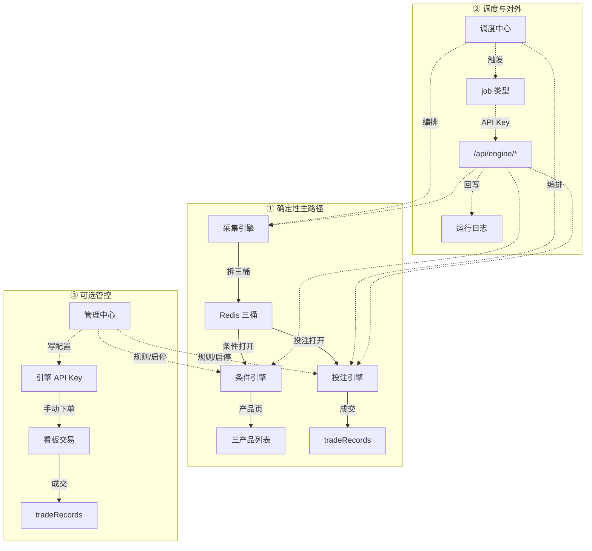

# 运行拓扑图

生成时间：2026-09-10  
地位：**网球三引擎运行全景**（现行产品口径；文档保留，管理员后台不提供该入口）  
并列文档：《盘中采集产品-全链路说明》《调度中心与API对外中心-设计》《引擎API对外中心-接口文档》

---

## 0. 图例与约定

| 线型 | 含义 |
|------|------|
| **实线** | 业务主路径（数据前进 / 成交） |
| **虚线** | 调度触发、配置写入、API 调用、状态回写 |

| 分层 | UI 底色 | 主题 |
|------|---------|------|
| ① | 浅蓝 | 确定性主路径 |
| ② | 浅橙 | 调度与对外 |
| ③ | 浅紫 | 可选管控 |

**关键约定（现行）**

- **条件引擎** 与 **投注引擎** 互不依赖。  
- 条件打开 → 只筛 **产品列表展示**。  
- 投注打开 → 直接读 **采集三桶**，按 **投注引擎自有规则** 过滤并下单（**不经** 条件引擎）。  
- 条件打开与否 **不阻止** `bet.scan` / 盘中 tick 内的投注逻辑。

---

## 1. 总览



ASCII 总览：

```
① 采集 ──拆三桶──► Redis 三桶
                      ├── 条件打开 ──► 条件引擎 ──产品页──► 三产品列表
                      └── 投注打开 ──► 投注引擎 ──成交──► tradeRecords

② 调度中心 ╌触发╌► job 类型 ╌API Key╌► /api/engine/* ╌回写╌► 运行日志

③ 管理中心 ╌写配置╌► 引擎 API Key ╌手动下单╌► 看板交易 ──成交──► tradeRecords
```

---

## 2. ① 确定性主路径

**一句话**：采集写三桶后分两路——条件筛列表 / 投注自筛下单。

### 2.1 上游（共用）

| 节点 | 说明 |
|------|------|
| **采集引擎** | IPWO → Sofascore；Top100 全量 enrichment；全量拆桶 |
| **Redis 三桶** | 盘前 / 盘中 / 盘后 + meta（排名、PM 等） |

```
采集引擎 ──拆三桶──► Redis 三桶
```

### 2.2 左路：列表（条件引擎）

| 节点 | 说明 |
|------|------|
| **条件引擎** | 多组 AND/OR、强现开区间等；**条件打开** 后筛列表；**不影响下单** |
| **三产品列表** | 盘前 / 盘中 / 盘后；用户可看；受条件开关约束 |

```
Redis 三桶 ──条件打开──► 条件引擎 ──产品页──► 三产品列表
```

读路径：`tennisPrematch` / `tennisInplay` / `tennisSettled` → `maybeApplyCondition`（仅列表）。

### 2.3 右路：下单（投注引擎）

| 节点 | 说明 |
|------|------|
| **投注引擎** | **投注打开** 后，用本引擎买入/止损规则（含需赢首盘、排除局分、金额等）直接过滤采集数据并下单 |
| **tradeRecords** | 买入 · 止损 · 盈亏分项 |

```
Redis 三桶 ──投注打开──► 投注引擎 ──成交──► tradeRecords
```

执行：`tennisBettingEngine.runBettingPass`（**不**调用 `maybeApplyCondition`）。

### 2.4 盘中特例

盘中 tick：**直连 Polymarket 刷价** → **先止损再买入**（不重走 Sofascore）；投注仍不经条件引擎。

---

## 3. ② 调度与对外

**一句话**：何时跑、怎么对外调、跑完记什么。

```
调度中心 ╌触发╌► job 类型 ╌API Key╌► /api/engine/* ╌回写╌► 运行日志
 interval/daily    collect.full           采集/条件/投注           scheduler_runs
 MySQL 任务表      inplay_tick · bet.scan  调度 CRUD               success / skipped
```

| 节点 | 职责 |
|------|------|
| **调度中心** | 任务编排、启停、频率（interval / daily） |
| **job 类型** | 典型：`collect.full`、`inplay_tick`、`bet.scan`（止损已并入 bet.scan） |
| **`/api/engine/*`** | 引擎 API Key 鉴权；采集 / 条件 / 投注 / 调度 CRUD |
| **运行日志** | `scheduler_runs`：success / skipped / 失败原因 |

说明：

- 调度不替代引擎业务逻辑，只触发与约束生命周期。  
- 有效 API Key 对 `/api/engine/*` 全量可调（不按角色拆 scope）。  
- 条件引擎一般不进周期调度；主编排采集与投注。  
- **条件打开不影响** `bet.scan` 是否执行。

---

## 4. ③ 可选管控

**一句话**：人在环路——改规则、发密钥、看板手操；可关。

```
管理中心 ╌写配置╌► 引擎 API Key ╌手动下单╌► 看板交易 ──成交──► tradeRecords
 三引擎配置页         签发 / 吊销              用户批量买           盘前/盘中分项
 启停 / 规则          eng_…                   盘中卖出             盈亏比
```

| 节点 | 职责 |
|------|------|
| **管理中心** | 采集 / 条件 / 投注配置页；启停与规则 |
| **引擎 API Key** | 签发 / 吊销；前缀 `eng_…` |
| **看板交易** | 产品看板批量买、盘中卖出等人工路径 |
| **tradeRecords** | 与自动投注共用成交落库 |

本层不是每场必经；主路径可全自动跑通。

---

## 5. 与代码入口对照

| 能力 | 入口 |
|------|------|
| 拓扑说明 | 本文（`docs/运行拓扑图.md`）；管理员后台无独立拓扑页 |
| 三引擎配置 | `TennisMonitor.vue`（collect / condition / betting） |
| 调度 UI / 存储 | `SchedulerCenter.vue` · `adminScheduler.js` · `schedulerStore` / `schedulerRunner` |
| 引擎 API | `engineApi.js` · `tennisEngines.js` |
| 列表条件筛 | `tennisConditionApply.maybeApplyCondition` |
| 投注扫描 | `tennisBettingEngine.runBettingPass`（独立于条件） |
| 盘中 tick | `tennisInplayTick` → 刷价后 `runBettingPass` |
| 采集脚本 | `scripts/tennis-monitor/` |

---

## 6. 开关语义速查

| 开关 | 生效对象 | 不生效对象 |
|------|----------|------------|
| **条件打开** | 三产品列表筛选 | 投注候选、自动下单 |
| **投注打开** | 自动买入/止损扫描 | 列表是否按条件筛 |
| **采集启停** | 全量/拆桶等采集任务 | — |

| 场景 | 列表 | 自动下单 |
|------|------|----------|
| 只开条件 | 按条件规则筛 | 否 |
| 只开投注 | 原始桶（+ 用户本地 chip） | 按投注规则对采集桶下单 |
| 两开 | 按条件筛 | 按投注规则对采集桶下单（可与条件通过集不同） |
| 两关 | 原始桶 | 否 |

---

## 7. 阅读顺序

1. 本文（运行全景与开关语义）  
2. 《盘中采集产品-全链路说明》（三桶与盘中细节）  
3. 《调度中心与API对外中心-设计》+ 《引擎API对外中心-接口文档》
