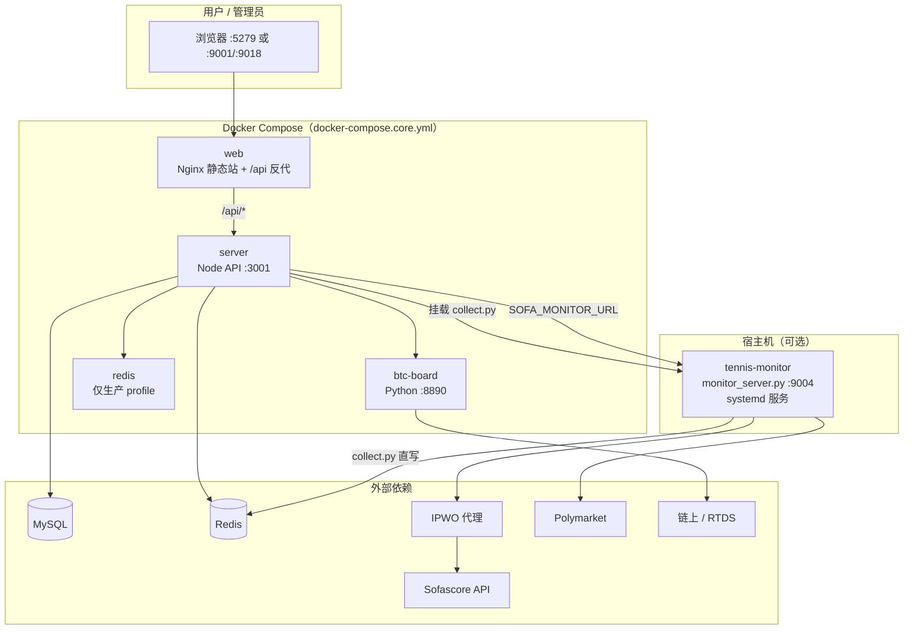
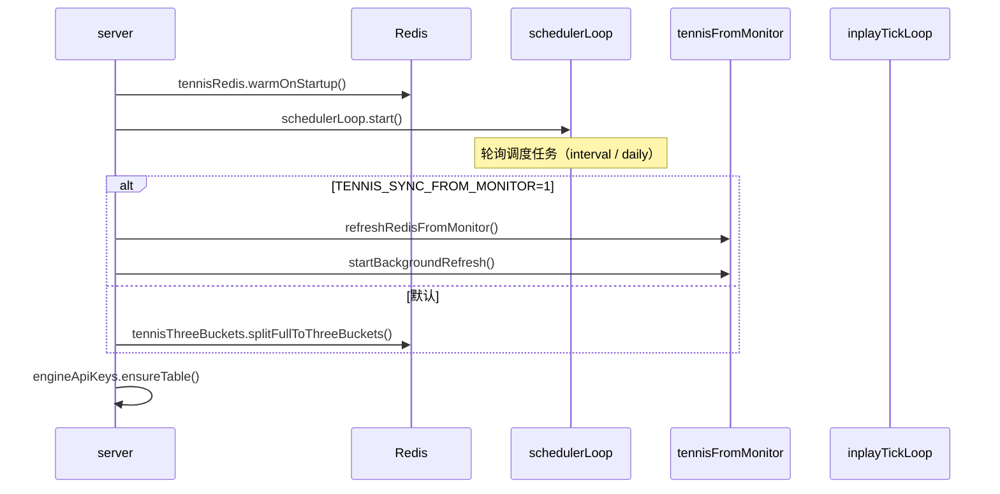
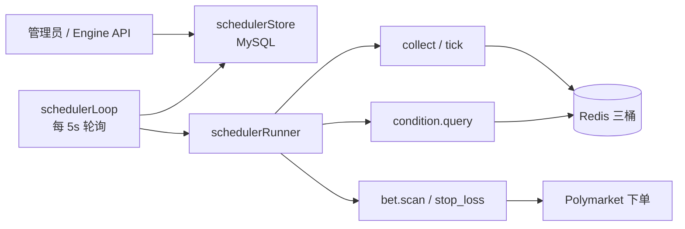
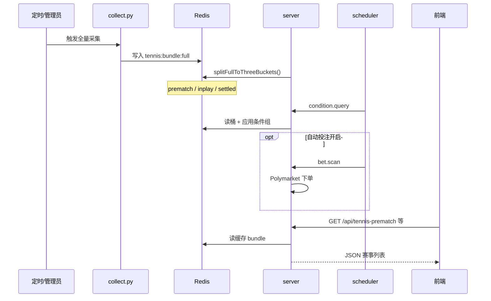

# 项目整体运行流程

本文描述 **teniesyuce** 从部署、启动、采集、调度到前端展示的完整运行链路。适合新人上手或排查「数据从哪来、任务谁触发、接口怎么走」。

---

## 1. 项目是什么

网球盘前 / 盘中 / 盘后 **数据采集 → Redis 三桶缓存 → 条件筛选 → 自动/手动投注 → 对外 API**，外加 **BTC 链上看板** 子系统。

| 目录 | 角色 |
|------|------|
| `client/` | Vue 前端（用户页 + 管理员调度/采集/引擎配置） |
| `server/` | Node.js API（业务、调度、投注引擎、对外 Engine API） |
| `scripts/tennis-monitor/` | Python 网球采集（Sofascore + IPWO 代理 + Polymarket） |
| `btc-board/` | Python BTC 链上 UP/DOWN 排行榜 |
| `dota2elo/` | Dota2 战队 Elo 评分与预测（iframe 产品） |
| `docks/` | 历史/虚拟赛事文本数据（测试用 txt 模式） |
| `deploy/` | Docker 测试/生产环境变量 |

---

## 2. 整体架构



**要点：**

- 对外只暴露 **web 端口**（测试 `9018`、生产 `9001`）和可选 **btc-board**（`8890`/`8891`）、**dota2elo**（`8892`/`8893`）。
- **server** 是业务中枢：读 Redis、跑调度、触发采集、对接 Polymarket 下单。
- **tennis-monitor** 可跑在宿主机 `:9004`（systemd），也可由 server 容器内直接执行 `collect.py`（挂载目录）。
- **MySQL** 存用户、订阅、产品、引擎配置、调度任务、API Key 等；**Redis** 存网球 bundle 三桶与采集缓存。

---

## 3. 三种运行形态

### 3.1 本机开发（Windows，推荐）

只跑前端 + API，数据库/Redis 可指向线上 215 共用数据。

```powershell
# 仓库根目录
powershell -ExecutionPolicy Bypass -File scripts/dev-local.ps1
```

| 进程 | 端口 | 说明 |
|------|------|------|
| `server` | 3001 | `cd server && npm run dev` |
| `client` | 5279 | Vite 开发服，`client/.env.local` 代理到 3001 |

浏览器：http://localhost:5279/

> 不要用 WSL 访问 `/mnt/d/...` 跑 Vite，IO 很慢。

### 3.2 Docker 发版（测试 / 生产）

```bash
cp server/.env.example server/.env          # 生产
cp server/.env.example server/.env.test     # 测试

bash scripts/docker-deploy.sh test up -d --build   # web :9018
bash scripts/docker-deploy.sh prod up -d --build   # web :9001
```

| 环境 | Compose 项目名 | Web | Redis | server env |
|------|----------------|-----|-------|------------|
| 测试 | `yuce-test` | 9018 | 外部（`.env.test` 里的 `REDIS_URL`） | `server/.env.test` |
| 生产 | `yuce-prod` | 9001 | compose 内 redis（profile `with-redis`） | `server/.env` |

健康检查：

```bash
curl -s http://127.0.0.1:9018/api/health   # 或 9001
# {"ok":true}
```

### 3.3 线上完整栈（Ubuntu）

推荐目录 `/opt/yuce`：

1. **Docker**：`redis`（生产）+ `server` + `web` + `btc-board` + `dota2elo`
2. **systemd**：`tennis-monitor.service` 在宿主机 `:9004` 跑定时/ live 采集
3. **monitor.env**：`monitor.env.test` / `monitor.env.prod` 配置 IPWO 代理（勿提交 Git）

详见 [deploy-server.md](./deploy-server.md)。

---

## 4. 服务启动顺序（server 进程）

`server` 启动后（`server/src/index.js`）会依次：



| 步骤 | 模块 | 作用 |
|------|------|------|
| 1 | `tennisRedis` | 预热 Redis 连接，检查 bundle 是否存在 |
| 2 | `schedulerLoop` | 内嵌调度循环，按任务配置触发 collect / condition / bet |
| 3 | `tennisFromMonitor` 或 `tennisThreeBuckets` | 从 9004 同步数据，或把全量包拆成三桶 |
| 4 | `engineApiKeys` | 确保对外 API Key 表存在 |
| 5 | `tennisInplayTickLoop` | scheduler 失败时的 fallback，盘中 tick 刷价 |

---

## 5. 数据采集流程

### 5.1 采集脚本

| 脚本 | 触发方式 | 输出 |
|------|----------|------|
| `collect.py` | 定时 6h / 管理员「立即采集」/ 调度 `collect.top100` | `tennis:bundle:full` + 三桶拆分 |
| `collect_live.py` | monitor :9004 轮询 / server 内嵌 | 进行中赛事 live bundle |

采集链路（简化）：

```
IPWO 代理 → Sofascore 赛程/排名
         → Polymarket 盘口匹配
         → Redis（full bundle）
         → server 拆分为 prematch / inplay / settled 三桶
```

### 5.2 两种采集执行路径

**路径 A — server 容器内直接跑（推荐「立即采集」）**

- Docker 挂载 `./scripts/tennis-monitor:/tennis-monitor`
- `tennisCollectRunner.js` 用 `spawn` 执行 `collect.py`
- 不依赖 9004 服务是否在线

**路径 B — 宿主机 monitor_server :9004**

- systemd 跑 `monitor_server.py`
- 提供 HTTP API（Top100、live、手动触发采集）
- server 通过 `SOFA_MONITOR_URL`（默认 `http://172.17.0.1:9004`）拉取并写入 Redis
- `schedule.json` 控制定时：`interval_hours: 6` 等

### 5.3 定期 6 小时采集（线上）

线上 cron / monitor 每 **6 小时** 跑一次 Top100 全量采集，写入 Redis 三桶。对外读数见 [网球定期6小时采集与线上单赛事下单API.md](./网球定期6小时采集与线上单赛事下单API.md)。

---

## 6. Redis 三桶数据模型

全量包 `tennis:bundle:full` 经 `tennisThreeBuckets.js` 拆成：

| Redis Key（概念） | 产品 | 含义 |
|-------------------|------|------|
| 盘前 prematch | 盘前网球 | 未开赛，强者现排 ≤100 等筛选 |
| 盘中 inplay | 盘中网球 | 进行中 Top100 |
| 盘后 settled | 盘后网球 | 已结束赛事 |

**迁移规则（自动）：**

- 开赛 → prematch 迁 inplay
- 结束 → inplay 迁 settled

**虚拟模式：** `tennisDataSource = docks500` 时从 `docks/` 文本造数，跳过真实 Sofascore 采集（联调/演示用）。

---

## 7. 调度引擎

调度中心（前端 `SchedulerCenter.vue` + API `/api/admin/scheduler/*`）管理任务；执行器在 server 进程内 `schedulerLoop` + `schedulerRunner`。

### 7.1 任务类型

| jobType | 说明 |
|---------|------|
| `collect.full` | 全量包 → 三桶拆分 + 迁移 |
| `collect.top100` | 触发 `collect.py`（Top100） |
| `collect.inplay_tick` | 盘中 tick，刷 Polymarket 价 |
| `condition.query` | 按条件组筛选 prematch/inplay/settled |
| `bet.scan` | 扫描并买入 |
| `bet.stop_loss` | 止损卖出 |

### 7.2 触发方式

- **interval**：每 N 秒/分钟
- **daily**：上海时区 HH:mm
- **manual**：管理员或 Engine API 立即执行（可并行）

引擎总开关在 `tennisEngines` 配置（采集 / 条件 / 投注 可分别关闭）。



---

## 8. 前端与 API 路由

### 8.1 前端

单页应用 `client/src/App.vue`，按登录角色切换视图：

| 视图 | 组件 | 面向 |
|------|------|------|
| 产品首页 | 产品列表 + 订阅 | 普通用户 |
| 盘前/盘中/盘后 | `TennisBoard` | 订阅用户 |
| BTC 看板 | `BtcBoard` | 订阅用户 |
| 采集管理 | `TennisMonitor` | 管理员 |
| 调度中心 | `SchedulerCenter` | 管理员 |
| Engine API Key | `EngineApiKeys` | 管理员 |

开发时 Vite 把 `/api` 代理到 `VITE_API_PROXY_TARGET`（默认 `http://127.0.0.1:3001`）。  
Docker 里 Nginx 反代 `/api/` → `server:3001`。

### 8.2 主要 API 前缀

| 前缀 | 用途 |
|------|------|
| `/api/auth` | 登录注册 JWT |
| `/api/products` `/api/subscriptions` | 产品与订阅 |
| `/api/tennis-prematch` `/api/tennis-inplay` `/api/tennis-settled` | 三桶读数 |
| `/api/tennis/orders` | 赛事下单（单场 email / 批量 JWT） |
| `/api/admin/tennis-monitor` | 采集状态、立即采集、schedule 配置 |
| `/api/admin/scheduler` | 调度任务 CRUD + 手动触发 |
| `/api/engine/*` | **对外 Engine API**（`X-Api-Key` 或 `Bearer eng_...`） |
| `/api/btc` | BTC 看板数据 |
| `/api/health` | 健康检查 |

---

## 9. 对外 Engine API

前缀 `/api/engine/*`，与网站 JWT **独立**，使用 API Key 鉴权。

典型能力（详见 [引擎API对外中心-接口文档.md](./引擎API对外中心-接口文档.md)）：

- 读三桶快照
- 触发调度任务
- 查询引擎/采集配置

线上 Base URL 示例：https://www.yuce.bid

---

## 10. BTC 看板子系统

`btc-board` 容器跑 `onchain_leaderboard.py`：

- 监听链上 / RTDS 价格
- 嵌入 `quick_trade.py` Web 面板
- 暴露 `:8890`（宿主机映射 `BOARD_PORT`）
- server 通过 `BOARD_PRODUCT_URL` 跳转或嵌入

与网球主链路 **相对独立**，共用 Docker 网络与部分 `.env` 配置。

---

## 11. 一次完整「从采集到展示」时序



---

## 12. 关键环境变量

| 变量 | 位置 | 说明 |
|------|------|------|
| `DB_*` | `server/.env` | MySQL |
| `REDIS_URL` | `server/.env` | Redis 连接 |
| `JWT_SECRET` | `server/.env` | 用户 JWT |
| `TENNIS_MONITOR_DIR` | server 容器 | 采集脚本挂载路径 |
| `SOFA_MONITOR_URL` | server | 宿主机 monitor 地址 |
| `SOFA_MONITOR_ENV_FILE` | deploy env | `monitor.env.test/prod` |
| `TENNIS_SYNC_FROM_MONITOR` | server | `1` 时从 9004 同步 Redis |
| `APP_ENV` | deploy env | `test` / `production` |
| `WEB_PORT` / `BOARD_PORT` | deploy env | 宿主机端口 |

IPWO 代理账号在 `scripts/tennis-monitor/monitor.env.*`，**勿提交 Git**。

---

## 13. 常用运维命令

```bash
# Docker 状态
bash scripts/docker-deploy.sh prod ps
bash scripts/docker-deploy.sh prod logs -f server

# 健康检查
curl -s http://127.0.0.1:9001/api/health

# 宿主机采集服务
sudo systemctl status tennis-monitor
sudo journalctl -u tennis-monitor -f

# 注册三产品（新环境一次性）
cd server && FORCE_PRODUCT_UPSERT=1 node scripts/upsert-tennis-three-products.js
```

---

## 14. 相关文档

| 文档 | 内容 |
|------|------|
| [deploy-server.md](./deploy-server.md) | 服务器部署、端口、monitor 迁移 |
| [网球定期6小时采集与线上单赛事下单API.md](./网球定期6小时采集与线上单赛事下单API.md) | 对外读数 + 单场下单 |
| [引擎API对外中心-接口文档.md](./引擎API对外中心-接口文档.md) | Engine API |
| [调度中心与API对外中心-设计.md](./调度中心与API对外中心-设计.md) | 调度与对外中心设计 |
| [盘中采集产品-全链路说明.md](./盘中采集产品-全链路说明.md) | 盘中产品细节 |
